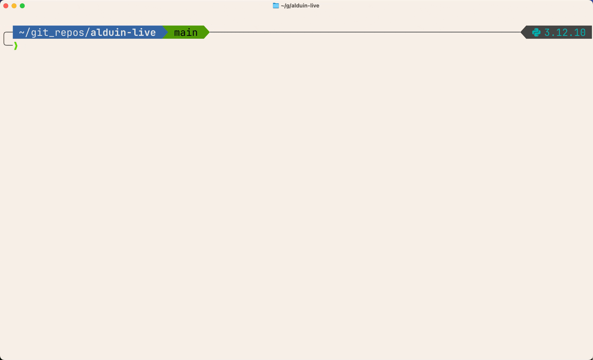

# Build Your Own CLI Coding Agent from Scratch

I ran a [hands-on workshop in Tokyo](https://luma.com/5yt57yep) where ~50 engineers built a CLI coding agent from scratch in **Python**. This is that exercise, converted into a self-paced format.

We start from a skeleton repo that has a basic input loop with a canned response (no LLM). Over six phases, we wire in the LLM, add tools (read file, edit file, bash), and build the core agent loop: the inner loop where the LLM and tools call each other repeatedly until the task is done.

The final phase is aspirational: we use the agent we just built to build itself, adding support for an `AGENTS.md` file that gives it persistent memory across sessions.

By the end we'll have a working coding agent we built ourselves and understand completely. The instructions at the end show how to install it as a global CLI tool so that we can use it on any codebase on our machine.

**Before starting: disable all AI assistance in your code editor.** Turn off GitHub Copilot, AI-powered autocomplete, and any other AI coding tools. Type every line yourself.

**What we're implementing:**

1. **LLM in the loop**: replace the canned response with an actual LLM call
2. **Read file tool**: implement the tool + pass its schema to the LLM + detect tool use in the response
3. **Tool execution**: execute the tool the LLM requested and display the result
4. **Agent loop**: the inner loop where tool results go back to the LLM until no more tool calls
5. **Edit file tool**: create and edit files
6. **Bash tool**: execute shell commands with user confirmation
7. **Memory**: use the agent to build the agent, add `AGENTS.md` support for persistent memory across sessions

## Architecture


## Setup

### 0. Disable AI assistance in your editor

Turn off GitHub Copilot and any other AI-powered coding tools before you start. This workshop is about understanding every line you write. If AI autocomplete is filling in the code for you, you'll finish faster but learn nothing. Using AI assistance to write the code here would defeat the purpose of the exercise.

### 1. Install uv

[uv](https://docs.astral.sh/uv/getting-started/installation/) is a fast Python package manager. Install it and verify:

```bash
uv --version
```

### 2. Get an Anthropic API Key

Go to the [Anthropic Console](https://console.anthropic.com/settings/keys) and create an API key. A few dollars of credit is enough.

### 3. Clone and configure

```bash
git clone https://github.com/primaprashant/alduin.git
cd alduin
cp .env.sample .env
# add your ANTHROPIC_API_KEY to .env
```

### 4. Install dependencies

```bash
make dep
```

This uses uv, so it handles Python 3.12, the virtualenv, and all dependencies automatically.

### 5. Verify the API key works

```bash
make check-api-key
```

### 6. Set up a shell alias

```bash
alias ald='uv run --no-sync python -m alduin.main'
```

Run `ald` to start the agent. Right now it only shows a canned response. If we run the agent at this stage, we should something like this:



---

## Codebase Reference

| File | What it does |
|---|---|
| `alduin/main.py` | Entry point + agent loop (this is where most of our work goes) |
| `alduin/llm.py` | Wrapper around `client.messages.create()`, already implemented |
| `alduin/tool.py` | Tool function stubs (`read_file`, `edit_file`, `bash`) + a working `list_files` |
| `alduin/schema_converter.py` | Converts Python functions with type hints + docstrings into Anthropic tool JSON schemas, already implemented |
| `alduin/system_prompt.py` | System prompt, already implemented |
| `alduin/ui.py` | Rich console helpers for printing messages, tool calls, results, errors, confirmations, already implemented |

The UI, schema converter, LLM wrapper, and system prompt are done. We're implementing the agent logic and the tools.

---

## Phase 1: LLM in the Loop

**Goal:** Replace the hardcoded response with an actual LLM call. Make it a chatbot with conversation memory.

**What to implement in `main.py`:**

- Import the `llm` and `system_prompt` modules
- Replace the canned `assistant_reply` with a call to `llm.call()`
- Append the LLM response to the conversation history
- Iterate over `llm_response.content` blocks and display text blocks using `ui.print_assistant_reply()`

<details>
<summary>Click here for hints</summary>

- `llm.call()` takes `client`, `console`, `system_prompt`, `messages`, and `tool_schemas`. Pass an empty list `[]` for `tool_schemas` for now
- The response object has `.content` (list of content blocks), and `.usage.input_tokens` / `.usage.output_tokens`
- Append `{"role": "assistant", "content": llm_response.content}` to the conversation list to maintain memory
- Each content block has a `.type` field. For now we only care about `"text"` blocks

</details>

**After this phase:** We have a chatbot. We can have a multi-turn conversation with the LLM.

**Try it:**

```
🧑‍💻 You: What is the most common programming language used in machine learning?
🧑‍💻 You: And who created it?
```

The second question should work because the LLM remembers context.

Check the reference implementation for this phase: https://github.com/primaprashant/alduin/commit/4b659c92aa0f9d974e687ddf2cccd351378cfbd4

After implementing this phase, the agent interaction should look something like this:


---

## Phase 2: Read File Tool

**Goal:** Implement `read_file`, generate its JSON schema, pass it to the LLM, and detect when the LLM wants to use it.

**What to implement:**

1. **In `tool.py`:** Implement `read_file(path)`. Read and return file contents.
2. **In `main.py`:**
   - Create a list of active tool functions: `[tool.read_file]`
   - Use `schema_converter.generate_tool_schema()` to convert them to JSON schemas
   - Pass those schemas to `llm.call()` via `tool_schemas`
   - When iterating content blocks, check for `block.type == "tool_use"`. For now just print the tool name and arguments

<details>
<summary>Click here for hints</summary>

- For `read_file`: use `pathlib.Path`. Check `p.is_file()` before reading, return an error string if the file doesn't exist
- `schema_converter.generate_tool_schema()` takes a list of functions and reads their type annotations and docstrings to produce the JSON schema. This is why the tool functions have typed parameters and Google-style docstrings
- A `tool_use` content block has `.name` (tool name) and `.input` (dict of arguments)
- We now need to handle two block types when iterating the response: `"text"` and `"tool_use"`

</details>

**After this phase:** When we ask the agent to read a file, we'll see it print the tool name and arguments the LLM requested. The tool doesn't execute yet.

**Try it:**

```
🧑‍💻 You: Read the Makefile in this project
```

We should see something like: `tool use requested for tool: read_file with args: {'path': 'Makefile'}`

Check the reference implementation for this phase: https://github.com/primaprashant/alduin/commit/c3c1e51fa8058d3b140cc9cace11eae1e3a16bbb

After implementing this phase, the agent interaction should look something like this:


---

## Phase 3: Tool Execution

**Goal:** Actually execute the tool the LLM requested and display the result.

**What to implement in `main.py`:**

- Write an `execute_tool()` function that:
  - Looks up the tool function by name from a lookup table
  - Handles unknown tools gracefully
  - Calls the tool function with the arguments from the LLM
  - Catches exceptions
  - Uses `ui.print_tool_request()` and `ui.print_tool_result()` (or `ui.print_tool_error()`) for display
- Build a lookup table mapping tool names (strings) to functions: `{fn.__name__: fn for fn in active_tools}`
- In the response handling loop, call `execute_tool()` instead of printing

<details>
<summary>Click here for hints</summary>

- The lookup table maps strings to callables, e.g. `{"read_file": tool.read_file}`
- Use `tool_fn(**args)` to call the function with the LLM-provided arguments dict
- Wrap the tool call in a try/except so a buggy tool doesn't crash the agent
- `ui.print_tool_request(console, name, args)` shows what's about to execute
- `ui.print_tool_result(console, name, result)` shows the result
- `ui.print_tool_error(console, name, error)` shows errors

</details>

**After this phase:** The tool executes and we see the result in the terminal. But the result doesn't go back to the LLM yet.

**Try it:**

```
🧑‍💻 You: Read the Makefile and tell me what targets are available
```

We'll see the file contents displayed as a tool result, but that's it. The result isn't being sent back to the LLM yet, so it won't produce a response. If we send another message, the program will crash because the LLM expects a tool result from the previous tool use but won't find it. This is what we fix in the next phase.

Check the reference implementation for this phase: https://github.com/primaprashant/alduin/commit/be73644c49eeb529cb8b211538ccb23660ff7868

After implementing this phase, the agent interaction should look something like this:


---

## Phase 4: The Agent Loop

**Goal:** Close the loop. Send tool results back to the LLM so it can reason about them and make further tool calls.

This is the core of any coding agent, an inner loop where:

1. Call the LLM
2. If the response contains tool calls, execute them, send results back, goto 1
3. If no tool calls, break out, wait for next user input

**What to implement in `main.py`:**

- Wrap the LLM call and response handling in a `while True` inner loop
- After processing all content blocks, collect tool results into a list of `{"type": "tool_result", "tool_use_id": block.id, "content": result}` dicts
- If there are tool results, append them as `{"role": "user", "content": tool_results}` to the conversation and continue the loop
- If there are no tool results, `break`

Also: add `tool.list_files` to the active tools list. Combined with `read_file`, the agent can now explore the codebase.

<details>
<summary>Click here for hints</summary>

- The Anthropic API expects tool results in a `user` message with `"type": "tool_result"` content blocks
- Each tool result needs the `tool_use_id` from the corresponding `tool_use` block. This is how the API matches results to requests
- The inner loop should break when the LLM response has no `tool_use` blocks (i.e., the tool_results list is empty)
- With `list_files` + `read_file`, the agent can list a directory, then read individual files: multi-step tool use

</details>

**After this phase:** We have a real agent. It can chain multiple tool calls together autonomously.

**Try it:**

```
🧑‍💻 You: Explore this codebase and write a concise summary of what each file does
```

Watch it call `list_files`, then `read_file` on each file, then produce a summary. This is the agent loop in action.

Check the reference implementation for this phase: https://github.com/primaprashant/alduin/commit/9ff401d2cd72b490a946ed60336204be87fd03d2

After implementing this phase, the agent interaction should look something like this:


---

## Phase 5: Edit File Tool

**Goal:** Implement `edit_file` so the agent can create new files and edit existing ones.

**What to implement:**

1. **In `tool.py`:** Implement `edit_file(path, old_str, new_str)`:
   - If `old_str` is empty, create a new file (write `new_str`)
   - If `old_str` is non-empty, find and replace in the existing file
2. **In `main.py`:** Add `tool.edit_file` to the active tools list

<details>
<summary>Click here for hints</summary>

- For new file creation: check that the file doesn't already exist and have content (to prevent accidental overwrites). Use `p.parent.mkdir(parents=True, exist_ok=True)` to create parent directories
- For editing: verify `old_str` exists in the file exactly once. If it appears 0 times, return an error. If it appears more than once, return an error asking for a more unique string
- Consider restricting edits to files within the current working directory (`Path.cwd()`) as a safety measure
- Use `p.resolve()` to normalize the path before the directory check

</details>

**After this phase:** The agent can create and modify files.

**Try it:**

```
🧑‍💻 You: Explore this codebase and write a concise summary of what each file does to a new file called summary.md
```

Then:

```
🧑‍💻 You: Edit the summary.md file to add more details about how to run the project
```

Check the reference implementation for this phase: https://github.com/primaprashant/alduin/commit/536c2e7b3f45fce2e1e124202ad6a3d8ca4bb444

After implementing this phase, the agent interaction should look something like this:


---

## Phase 6: Bash Tool

**Goal:** Implement `bash` so the agent can run shell commands, with user confirmation before execution.

**What to implement:**

1. **In `tool.py`:** Implement `bash(command)`:
   - Prompt the user for confirmation before running anything
   - Execute the command using `subprocess`
   - Capture stdout, stderr, and the exit code
   - Handle timeouts
2. **In `main.py`:** Add `tool.bash` to the active tools list

<details>
<summary>Click here for hints</summary>

- Use `ui.confirm(console, command)` to ask the user before executing. We'll need to create a `Console` instance inside the function since `bash()` doesn't receive one as a parameter
- Use `subprocess.run(["bash", "-c", command], capture_output=True, text=True, timeout=10)` for execution
- Catch `subprocess.TimeoutExpired` separately
- Combine stdout, stderr, and return code into a single result string so the LLM gets the full picture
- Return a clear message if the user rejects the command

</details>

**After this phase:** We have a complete coding agent with read, edit, and bash capabilities.

**Try it:**

```
🧑‍💻 You: check makefile and format the codebase
```

Check the reference implementation for this phase: https://github.com/primaprashant/alduin/commit/83771b2ec67fb87b23dfc87af8370654739ea2d8

We've built a coding agent! The same core architecture (an LLM in a loop with tools) is what powers Claude Code, Cursor, Codex, and every other coding agent.

---

## Phase 7: Memory (Aspirational)

**Goal:** Use the coding agent we just built to build the coding agent. Add session memory by supporting an `AGENTS.md` file.

We now have a working coding agent with read, edit, and bash tools. That's enough to start using it on itself. In this phase, we launch our agent and ask it to implement a new feature: loading a memory file at startup.

**What to ask the agent to implement:**

- At startup, check if an `agents.md` file exists in the current working directory
- If it exists, read its contents and append them to the system prompt

This gives us persistent memory across sessions. We can add an `AGENTS.md` into any project with notes like coding conventions, architecture decisions, or repo-specific instructions, and the agent picks them up automatically.

**Try it:**

Launch the agent and ask it to build this feature:

```
🧑‍💻 You: Add a feature to this codebase: at startup, check if an AGENTS.md file exists in the current working directory. If it does, read its contents and append them to the system prompt
```

Then create an `AGENTS.md` in the project directory, restart the agent, and verify it picked up the contents.

There is no reference implementation for this phase. This is an open-ended challenge to see if you can use the agent to improve itself.

---

## Using the Agent on Other Codebases

The agent works on its own codebase during the workshop, but we can use it on other projects on our machine as well. We can install it as a global CLI tool so it's available from any directory.

### 1. Pull latest changes (or add the entry point manually)

Either pull the latest `main` branch which already has this, or add the following to `pyproject.toml`:

```toml
[project.scripts]
alduin = "alduin.main:main"

[tool.setuptools.packages.find]
include = ["alduin*"]
```

### 2. Install as a global tool

Run this from the project root of this agent codebase:

```bash
uv tool install --editable .
```

This makes the `alduin` command available system-wide.

### 3. Set up the API key

```bash
export ANTHROPIC_API_KEY="your-key-here"
```

To persist this across sessions, add the export to the relevant shell config (`~/.bashrc`, `~/.zshrc`, or `~/.config/fish/config.fish`).

### 4. Run it anywhere

```bash
cd ~/some-other-project
alduin
```

The agent will be able to explore, read, edit, and run commands in this new codebase. Now we have a coding agent that we built ourselves, helping us to work with any codebase on our machine!
